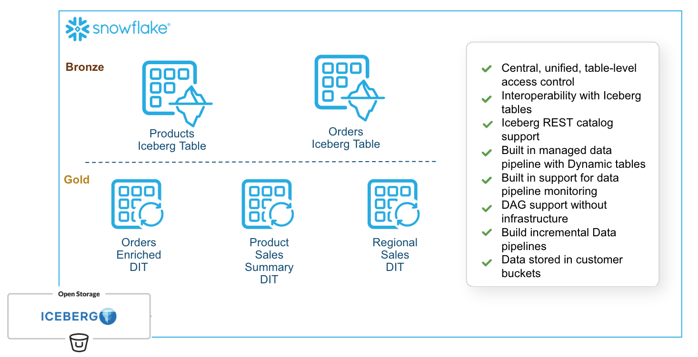

# Dynamic Iceberg Tables Demo

A comprehensive demo showcasing **Dynamic Iceberg Tables** in Snowflake - combining automated data pipelines with the Apache Iceberg format.

## Overview

Dynamic Iceberg Tables extend Snowflake's Dynamic Tables with Iceberg storage, enabling:
- Automated incremental data transformations
- Open table format (Iceberg) for interoperability
- External cloud storage (S3, Azure, GCS)
- Optimized refreshes with IMMUTABLE WHERE

## Project Structure

```
dt_ice/
├── README.md                          # This file
├── 01_setup.sql                       # Infrastructure setup
├── 02_source_tables.sql               # Source Iceberg tables
├── 03_dynamic_iceberg.sql             # Dynamic Iceberg Tables
├── 04_demo_operations.sql             # Monitoring & queries
├── 05_demo_immutability_backfill.sql  # IMMUTABLE WHERE examples
├── 06_cleanup.sql                     # Snowflake cleanup
└── 07_s3_cleanup.sql                  # S3 data cleanup
```



## Key Concepts

### 1. External Volume
Defines where Iceberg data is stored in cloud storage:
```sql
CREATE EXTERNAL VOLUME dt_ice_ext_volume
    STORAGE_LOCATIONS = (
        (
            NAME = 'dt_ice_s3_location'
            STORAGE_PROVIDER = 'S3'
            STORAGE_BASE_URL = 's3://bucket/path/'
            STORAGE_AWS_ROLE_ARN = 'arn:aws:iam::...'
        )
    )
    ALLOW_WRITES = TRUE;
```

### 2. Iceberg Tables (Source)
Regular Iceberg tables for staging data:
```sql
CREATE ICEBERG TABLE orders_staging (
    order_id NUMBER,
    ...
)
    EXTERNAL_VOLUME = 'dt_ice_ext_volume'
    CATALOG = 'SNOWFLAKE'
    BASE_LOCATION = 'orders_staging/';
```

### 3. Dynamic Iceberg Tables
Automated transformation pipelines with Iceberg storage:
```sql
CREATE DYNAMIC ICEBERG TABLE order_details_dit
(
    order_id NUMBER,
    ...
)
    TARGET_LAG = '10 minutes'
    WAREHOUSE = DT_ICE_WH
    EXTERNAL_VOLUME = 'dt_ice_ext_volume'
    CATALOG = 'SNOWFLAKE'
    BASE_LOCATION = 'order_details_dit/'
AS
SELECT ...
FROM orders_staging o
JOIN products_staging p ON o.product_id = p.product_id;
```

### 4. TARGET_LAG
Controls data freshness - how stale data can be before refresh:
- `'10 minutes'` - Near real-time
- `'1 hour'` - Hourly refresh
- `'DOWNSTREAM'` - Refresh when downstream tables need it

### 5. IMMUTABLE WHERE
Marks rows as unchangeable to skip during incremental refresh:

**Status-based (recommended):**
```sql
IMMUTABLE WHERE (order_status = 'COMPLETED')
```

**Fixed date cutoff:**
```sql
IMMUTABLE WHERE (order_month < '2024-01-01')
```

**Rule:** The immutable region must only GROW over time, never shrink.

## Limitations Discovered

| Feature | Dynamic Tables | Dynamic Iceberg Tables |
|---------|---------------|----------------------|
| IF NOT EXISTS | ✅ Supported | ❌ Not supported |
| BACKFILL FROM | ✅ Supported | ❌ Not supported |
| ALTER IMMUTABLE | ✅ Supported | ❌ Not supported |
| Clone | ✅ Supported | ❌ Not supported |
| TIMESTAMP DEFAULT | ✅ Supported | ❌ Use explicit values |

## Common Errors & Solutions

### 1. DEFAULT value data type mismatch for TIMESTAMP_NTZ
**Error:** `Default value data type does not match data type for column CREATED_AT`

**Solution:** Remove DEFAULT clause, use explicit CURRENT_TIMESTAMP() in INSERT:
```sql
-- Don't use DEFAULT
CREATE ICEBERG TABLE t (created_at TIMESTAMP_NTZ);

-- Use explicit value
INSERT INTO t (created_at) VALUES (CURRENT_TIMESTAMP());
```

### 2. Immutable region shrinks over time
**Error:** `Dynamic Tables do not support Immutable Constraints where the region of immutable rows shrinks over time`

**Bad:** `IMMUTABLE WHERE (order_date < CURRENT_DATE() - 7)` (shrinks daily)

**Good:** `IMMUTABLE WHERE (order_status = 'COMPLETED')` (only grows)

### 3. Cannot backfill from/to Iceberg
**Error:** `Cannot backfill from an Iceberg table` or `Cannot backfill to an Iceberg Dynamic table`

**Solution:** BACKFILL is not supported for Dynamic Iceberg Tables. Use standard Iceberg tables for historical data.

### 4. STORAGE_AWS_IAM_USER_ARN invalid parameter
**Error:** Invalid parameter in external volume creation

**Solution:** `STORAGE_AWS_IAM_USER_ARN` and `STORAGE_AWS_EXTERNAL_ID` are OUTPUT parameters from `DESC EXTERNAL VOLUME`, not INPUT parameters.

### 5. Iceberg folder naming
Snowflake appends a unique suffix to BASE_LOCATION folders:
- Specified: `products_staging/`
- Actual: `products_staging.kTkUsUpz/`

This is expected behavior for Snowflake-managed Iceberg tables.

## Running the Demo

### Option 1: Snowflake Notebooks (Recommended)
1. Upload `dynamic_iceberg_tables_demo.ipynb` to Snowsight
2. Update external volume configuration (S3 bucket, IAM role)
3. Run cells sequentially
4. When done, run `cleanup.ipynb`

### Option 2: SQL Scripts
Run scripts in order:
```bash
# In Snowsight or SnowSQL
!source 01_setup.sql
!source 02_source_tables.sql
!source 03_dynamic_iceberg.sql
!source 04_demo_operations.sql
!source 05_demo_immutability_backfill.sql

# Cleanup
!source 06_cleanup.sql
!source 07_s3_cleanup.sql
```

## Configuration

Update these values for your environment:

| Parameter | Location | Example |
|-----------|----------|---------|
| S3 Bucket | 01_setup.sql | `s3://your-bucket/path/` |
| IAM Role ARN | 01_setup.sql | `arn:aws:iam::123456789:role/...` |
| Storage Integration | 07_s3_cleanup.sql | `STRG_INT_DATA_ENG` |
| Role | All files | `SYSADMIN` |

## Monitoring

### Check refresh history
```sql
SELECT * FROM TABLE(INFORMATION_SCHEMA.DYNAMIC_TABLE_REFRESH_HISTORY(
    NAME => 'DT_ICE_DEMO.DEMO.ORDER_DETAILS_DIT'
)) ORDER BY REFRESH_START_TIME DESC;
```

### View all Dynamic Tables
```sql
SHOW DYNAMIC TABLES IN SCHEMA DT_ICE_DEMO.DEMO;
```

### Manual refresh
```sql
ALTER DYNAMIC TABLE order_details_dit REFRESH;
```

## References

- [Dynamic Tables Overview](https://docs.snowflake.com/en/user-guide/dynamic-tables-about)
- [Iceberg Tables](https://docs.snowflake.com/en/user-guide/tables-iceberg)
- [External Volumes](https://docs.snowflake.com/en/sql-reference/sql/create-external-volume)
- [IMMUTABLE WHERE](https://docs.snowflake.com/en/user-guide/dynamic-tables-refresh#label-dt-immutable)
